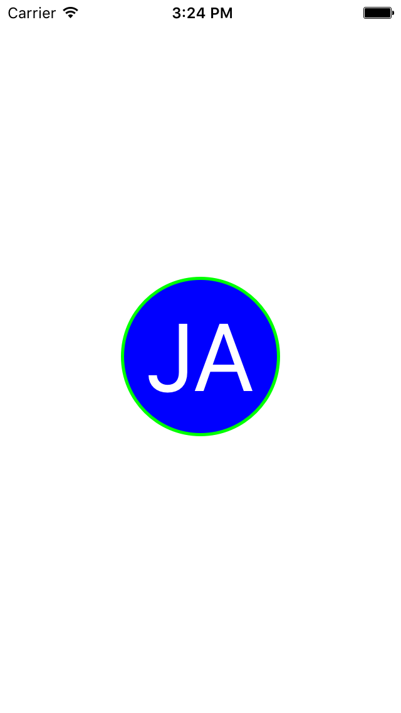

# initials-circle-swift
--------------

By Feng Guo

Purpose
--------------
Initials Circle uses native Swift to generate an `UIImage` circle with initials by using one line of the code. The font will dynamically adjust based on the size of the circle.



How to use
--------------
```swift
initialIcon.image = FGInitialCircleImage.circleImage("John", lastName: "Appleseed", size: initialIcon.frame.size.width, borderWidth: 5, borderColor: UIColor.greenColor(), backgroundColor: UIColor.blueColor(), textColor: UIColor.whiteColor());
```

Simply pass strings of `firstName`, `lastName`, diameter of the circle, border color and width, background color and text color. It will automatically calcuate the best font size in the circle.